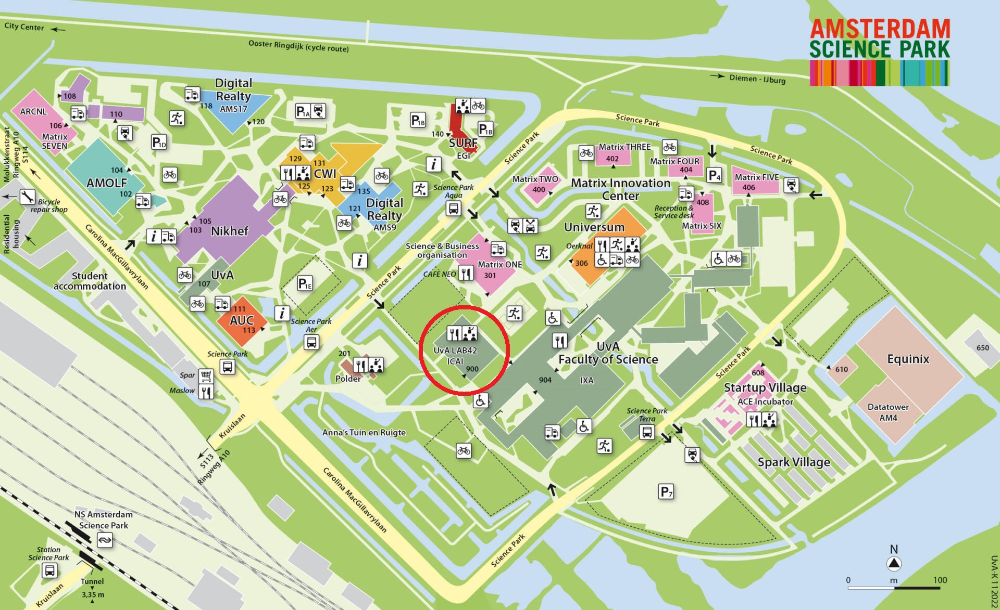

## Asking questions
There are three ways to get help:

**Helpdesk (Programmeerbalie)** (online/on campus): You can book a slot to get to talk directly to an assistant. [Helpdesk info](/general-info/help#helpdesk)

**Lab sessions** (on campus): You'll work on the Science Park campus (together with other students) in a classroom. You can ask us questions while you're working on your assignments. [Lab info](/general-info/help#lab-sessions)

**Forum** (online): We use Ed as an online discussion platform. Here you can discuss the assignments with other students and also the staff. [Ed info](/general-info/help#ed)

### Schedule helpdesk and lab sessions

| Week               | Mon                                | Tue                                    | Wed                                | Thu                               | Fri                               |
| ------------------ | ---------------------------------- | -------------------------------------- | ---------------------------------- | --------------------------------- | --------------------------------- |
| 14 - 22 (3/4/2023 - 2/6/2023)  | 9:00 - 11:00 Helpdesk (online)  -  17:00-19:00 Lab (Science Park L1.04) | 13:00-15:00 Lab (Science Park L0.11) | 9:00 - 11:00 Helpdesk (online/L1.10)  -  15:00 - 17:00 Heldesk (online) | 13:00 - 15:00 Lab (Science Park L0.06) |  |

You can also find this schedule in Datanose: [here](https://datanose.nl/#course[111445])

All lab sessions take place at Lab42 on the Science Park campus, for which a map is included below.

### Helpdesk

The helpdesk is the way to get one-on-one online help with your programming assignments.

* The helpdesk is available online.
* The helpdesk is available on three moments throughout the week.
* **You have to make an appointment**. You can make an appointment (up to three days ahead) using this link: [Book Helpdesk](https://outlook.office365.com/owa/calendar/UniversiteitvanAmsterdam1@Amsuni.onmicrosoft.com/bookings/s/YkpwFIJMMkqDLSs-Fd-dhw2)
* Join us on Teams: [Scientific Programming Teams](https://teams.microsoft.com/l/meetup-join/19%3ameeting_NjE5YWUyNTAtNzA5Ny00ODZjLTk2MzItMzkzYjgzZjY2NTFk%40thread.v2/0?context=%7b%22Tid%22%3a%22a0f1cacd-618c-4403-b945-76fb3d6874e5%22%2c%22Oid%22%3a%229290e777-ffaa-4e83-b0cf-9449ff933d7f%22%7d)
* On Tuesdays you can also choose to join the helpdesk on campus.

### Ed

We use Ed as an online discussion platform. Here you can discuss the assignments with other students and also the staff.

* Use the forum: [Ed forum](https://edstem.org/eu/courses/331/discussion/).
* If you don't have access to the forum yet, please send and [email](mailto:scientific@mprog.nl) to get access.

### Lab sessions

The lab sessions are the most classic way of getting help with your programming. You'll work on campus (together with other students) in a classroom. You can ask us questions while you're working on your assignments.

* This is a good place to work on your assignments and get immediate help.
* This is the main place where you can meet other students.
* There is no online version of this. If you want to work online, you can always use the helpdesk to talk to an assistant.
